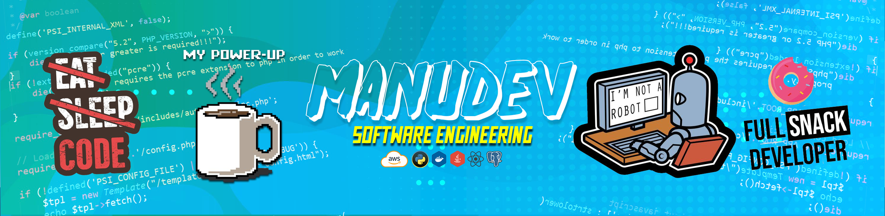

## Hola, mi nombre es Sergio y soy el creador de MANUDEV! 🖐
### Ingeniero de Software & Creador de contenido (Programacion y Ciberserguridad)

Soy creador de contenido en YouTube desde el año 2019 y me desempeñe como freelance full-stack Dev. desde el año 2020.

He trabajado con diferentes clientes y empresas especialmente bancarias, me encanta el desarrollo de software y todo el tema de la ciberseguridad.

Egrese de un colegio que su enfoque principal es la docencia y creo que eso influyo mucho en mi, ya que me encanta enseñar y quiero algun dia llegar a ser profesor de ingenieria, pero por el momento utilizo mis redes sociales para mostrar un poco de lo que se y he aprendido.

## Encuéntrame en:

 

 

## Algunos vídeos en YouTube:

<table style="width:100%">
<tr>
<td>

</td>
<td>

</td>
<td>

</td>
</tr>
<tr>
<td>

</td>
<td>

</td>
<td>

</td>
</tr>
<tr>
</table>
